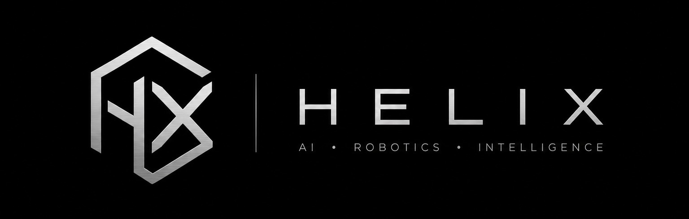

<p align="center">
  
</p>

# Loophole Robotics

[](LICENSE)
[](./loophole-arm/CHANGELOG.md)
[](https://github.com/Helix-AI-Robotics)

A robotics control stack by [**Helix**](https://github.com/Helix-AI-Robotics)
with **sim-to-real parity** by design: teach a skill in simulation, replay it
on hardware later, no code changes.

The flagship application is **Loophole Arm**, a 6-DOF Feetech-servo
manipulator with a layered control stack, a safety supervisor, multi-arm
support, and a server/client architecture so multiple terminals can drive
different robots in one shared simulation.

---

## Quick start (5 minutes, no hardware)

```bash
# 1. Install
cd loophole-arm
pip install -r requirements.txt
pip install -e .
bash scripts/fetch_menagerie.sh        # one-time, downloads reference models

# 2. Run the canonical demo (teach + replay a pick-and-place)
loophole-arm-teach demo
#   → "Teaching pick_place_demo..."  prints 10 waypoints  → replays them
```

If that printed `Playback complete` you're set. Skip to **What you can do next**.

---

## The four CLIs

```
loophole-arm-teach    teach-and-repeat workflows (in-process, no server)
loophole-arm-sim      the research / reward-hacking sim (the original demo)
loophole-armd         the multi-terminal simulation server
loophole-arm-teleop   numpad teleop, connects to loophole-armd
```

You only need `loophole-arm-teach` to do the demo. The other three are for the
multi-terminal architecture (see below).

---

## What you can do next

### 1. Drive the arm by hand with the numpad

```bash
# Terminal 1: start the simulation server
loophole-armd
#   → opens a MuJoCo window with the arm + two cubes
#   → listens for clients on 127.0.0.1:8765

# Terminal 2: connect with the numpad teleop
loophole-arm-teleop arm
#   → press numpad keys to move the gripper:
#       7 +Z up        8 +Y left      9 open gripper
#       4 -X back      5 home         6 +X forward
#       1 close grip   2 -Y right     3 -Z down
#       + / -  bigger / smaller step  |  0  print position
#       e      e-stop                 |  r  reset safety
#       q / Esc  quit
```

The TCP position is printed live on every keypress.

### 2. Teach a skill, save it, replay it

```bash
# Method A — interactive in-process (no server needed):
loophole-arm-teach teach --name my_skill
#   → opens the viewer; at the teach> prompt:
#       cart 0.18 0.08 0.18 above pick
#       cart 0.18 0.08 0.12 grasp
#       grip close
#       cart 0.18 0.08 0.18 lift
#       cart 0.18 -0.08 0.12 place
#       grip open
#       save my_skill
#       done

# Method B — teach over the wire while loophole-armd is running:
loophole-arm-teach connect arm --name my_skill
#   → same prompt, but drives the running server's arm

# Replay any saved skill:
loophole-arm-teach play skills/my_skill.json
loophole-arm-teach play skills/my_skill.json --loops 3
loophole-arm-teach show skills/my_skill.json     # inspect waypoints
```

### 3. Run a multi-arm scene

```bash
# Two arms side by side, each independently controllable:
loophole-armd --arm arm_a --arm arm_b

# Or load a fully described scene from YAML:
loophole-armd --scene examples/scenes/pickplace_dual.yaml
loophole-armd --scene examples/scenes/handoff_triple.yaml
```

Connect a client to each arm from its own terminal:
```bash
# Terminal 2:  loophole-arm-teleop arm_a
# Terminal 3:  loophole-arm-teach connect arm_b --name handoff
```

### 4. Build your own scene

Copy `examples/scenes/pickplace_dual.yaml` and edit:
- `arms:` — add/remove robots, change `mount_pos`, change `kind`
  (each can have its own `safety:` block)
- `scene.tables:` — add/move workbenches
- `scene.objects:` — add `cube` / `sphere` / `cylinder`, set color, position

See `examples/scenes/README.md` for the full schema.

---

## How it's built

```
commands.py / teach skill          ← what the robot does (the editable layer)
        │
RobotController (3-layer API)      ← joints / task-space (mink IK) / skills
        │
SafetyBackend                      ← limits, velocity caps, workspace, e-stop
        │
RobotInterface                     ← the sim-to-real / over-the-wire seam
   ┌────┼────┐
SimBackend  HardwareBackend  RemoteBackend
(MuJoCo)    (Feetech servos)  (talks to loophole-armd)
```

One interface, three backends. The controller, safety layer, IK solver, teach
product, and teleop all target the interface, so a skill validated in sim
deploys to hardware unchanged, and a client driving a local sim works the same
way as one driving a remote server.

Full architecture (Python / ROS 2 / C++ / firmware split, what we add when):
[`loophole-arm/docs/ARCHITECTURE.md`](./loophole-arm/docs/ARCHITECTURE.md)

---

## Status

| | |
| --- | --- |
| **In-process sim & control** | working: teach, play, sim_cli, reward-hacking sim |
| **Multi-terminal server** | working: `loophole-armd`, numpad teleop, teach over the wire |
| **Multi-arm in one scene** | working: 2+ arms via repeated `--arm`, or YAML |
| **YAML scene configs** | working: per-arm safety limits, tables, objects |
| **Hardware (Feetech)** | structural: `HardwareBackend` + `MotorMapper` ready, needs bench calibration |
| **Camera-guided manipulation** | planned |

81 tests passing, lint clean.

---

## Docs

| | |
| --- | --- |
| [`loophole-arm/README.md`](./loophole-arm/README.md) | Loophole Arm in detail |
| [`docs/ARCHITECTURE.md`](./loophole-arm/docs/ARCHITECTURE.md) | Language split (Python / ROS2 / C++ / firmware) |
| [`docs/HARDWARE_COSTS.md`](./docs/HARDWARE_COSTS.md) | Honest hardware costs per tier |
| [`docs/INDUSTRIAL_DEPLOYMENT.md`](./docs/INDUSTRIAL_DEPLOYMENT.md) | Production deployment guide |
| [`docs/AI_AGENTS.md`](./docs/AI_AGENTS.md) | Imitation-learning roadmap |
| [`docs/WORKFLOW.md`](./docs/WORKFLOW.md) | Day-to-day developer workflow |

---

## License

MIT — see [LICENSE](LICENSE). Vendored MuJoCo Menagerie models keep their
original Apache-2.0 licenses.
